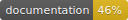

# AZCountDown
A customizable countdown view for Swift 🚀

 

## Preview

### Features
- [x] Easy to implement.
- [x] Highly customizable.
- [x] Smooth animations.
- [x] Persian or Arabic numbers support.

## Documentation
You can find [the docs here](http://shadow-of-arman.github.io/AZCountDown/). Documentation is generated with [jazzy](https://github.com/realm/jazzy) and hosted on [GitHub-Pages](https://pages.github.com).

## Community

- Found a bug? Open an [issue](https://github.com/shadow-of-arman/AZCountDown/issues).
- Feature idea? Open an [issue](https://github.com/shadow-of-arman/AZCountDown/issues).
- Want to contribute? Submit a [pull request](https://github.com/shadow-of-arman/AZCountDown/pulls).

## Resources

* [Swift Evolution](https://github.com/apple/swift-evolution)

## License

AZCountDown is available under the MIT license, see the [LICENSE](https://github.com/shadow-of-arman/AZCountDown/blob/master/LICENSE) file for more information.